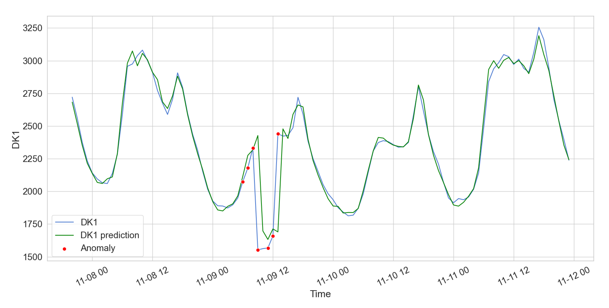

# Tutorial: Anomaly Detection in Multivariate Time Series with Keras and LSTM Layers

Based on the power Consumption data from Denmark (DK) between 2013 and now, available at the Nord Pool's Web site: [Nord Pool - Historical Market Data](https://www.nordpoolgroup.com/historical-market-data/)

If you have any comments or questions, you are welcome to leave them in the [Issues](./../../issues) section.

The entire code notebook is available in this repository: [Anomaly Detecton](./anomaly_detection.ipynb)

You can also execute the entire code in the
.

Example anomaly graph generated by the notebook based on the downloaded data:

## Introduction

In this tutorial I am going to present a simple solution of how to make predictions and anomaly detection in multivariate time series (i.e. a time series with many columns). We will predict a multistep future based on a multistep past. The solution can be applied to any time series.

The first step is to load the data and have a look at it. Deep learning works best with large sets of data. For this tutorial I have chosen the power consumption data in Denmark, where I live. The data can be downloaded from the <a href="https://www.nordpoolgroup.com/historical-market-data/" target="_blank">Historical Market Data</a> section on the Nord Pool' Web site, where energy-related data from all nordic countries can be found.

The power consumption data for Denmark spans from 2013 until now, and contains power consumption in MWh per hour for the country a as whole (DK) as well as for each of its two power distribution regions (DK1 and DK2).
